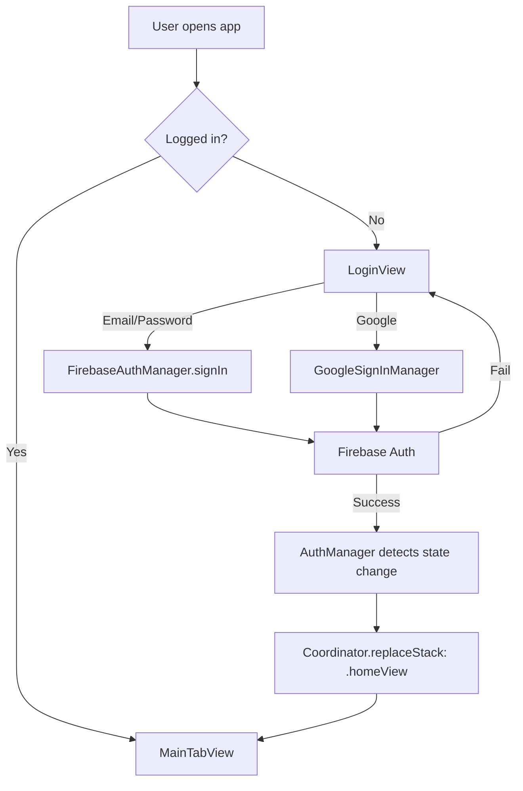
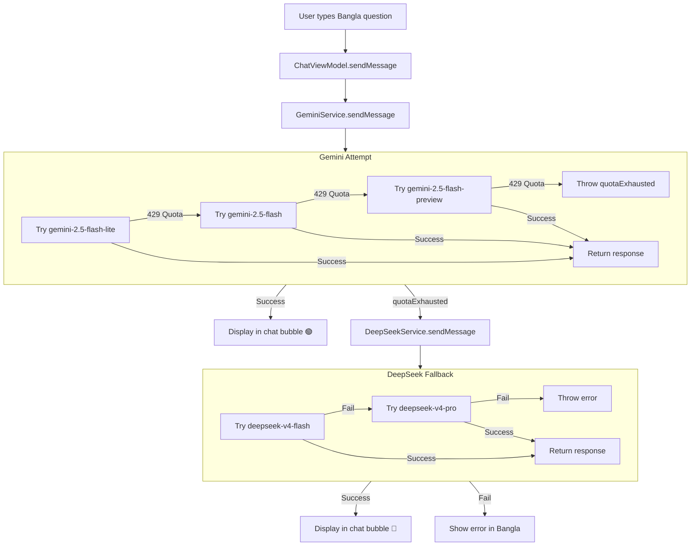
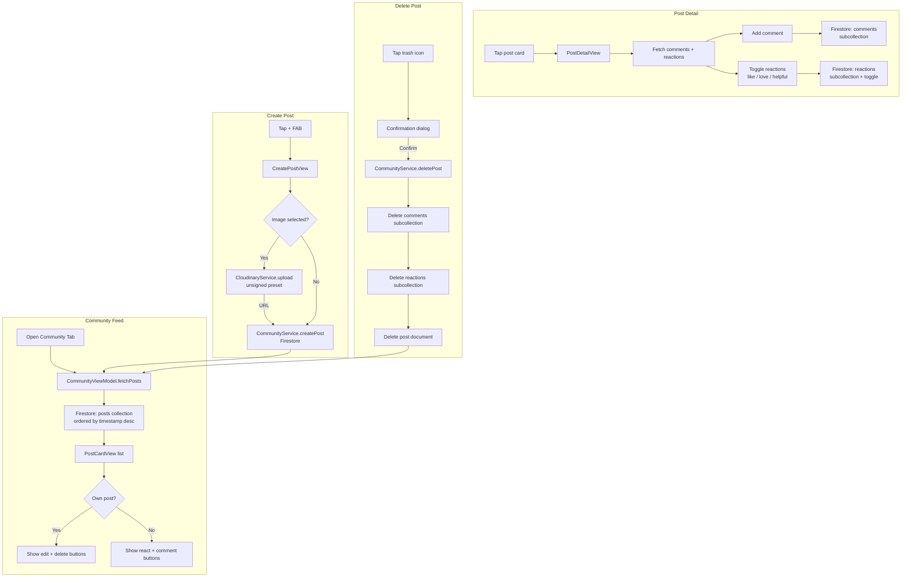

# 🌾 Agri AI — Smart Farming Assistant

> An iOS app for Bangladeshi farmers to diagnose plant diseases via on-device AI, get Bangla treatment advice with medicine recommendations, check spray-weather windows, chat with an AI assistant in Bangla, and connect with a farming community.

---

## 📱 Features

| Feature | Description |
|---------|-------------|
| **🔬 Disease Scanner** | Take a photo of a diseased leaf → on-device TFLite model classifies 29 diseases across Mango, Potato, Rice, Tomato |
| **📋 AI Bangla Report** | One tap generates a farmer-friendly Bangla report with disease name, causes, symptoms, step-by-step advice, and specific medicine brand names available in Bangladesh |
| **📄 PDF Export** | Download the report as a formatted PDF and share via AirDrop, WhatsApp, Files, etc. |
| **🌦️ Weather & Spraying** | Real-time weather from Agromonitoring API + Delta-T spray window calculator tells farmers when to spray (optimal / marginal / poor) |
| **💬 AI Chat (বাংলা)** | Ask any farming question in Bangla — powered by Gemini 2.5 Flash (with DeepSeek fallback) — uses simple words, emojis, bullet points |
| **👥 Community** | Post photos, share tips, comment, and react (👍/❤️/🙏) with other farmers. Edit or delete your own posts. |
| **👤 Profile** | Upload profile photo via PhotosPicker → Cloudinary → Firestore URL — visible on posts and drawer |
| **🗺️ Navigation Drawer** | Slide-out menu with quick access to all features, profile, and logout |

### 🗂️ 29 Disease Classes

```
🥭 Mango (8)   — Anthracnose, Bacterial Canker, Cutting Weevil, Die Back,
                 Gall Midge, Healthy, Powdery Mildew, Sooty Mould
🥔 Potato (3)  — Early Blight, Late Blight, Healthy
🌾 Rice (9)    — Bacterial Leaf Blight, Brown Spot, Healthy, Hispa,
                 Leaf Blast, Leaf Scald, Narrow Brown Leaf Spot, Sheath Blight
🍅 Tomato (9)  — Bacterial Spot, Early Blight, Late Blight, Leaf Mold,
                 Septoria Leaf Spot, Spider Mites, Target Spot,
                 Yellow Leaf Curl Virus, Mosaic Virus, Healthy
```

---

## 📋 Requirements

| Requirement | Minimum |
|-------------|---------|
| **iOS** | 16.6+ |
| **Device** | iPhone (all models with camera) |
| **Storage** | ~200 MB free |
| **Internet** | Required for weather, chat, community, AI reports (classification runs 100% on-device) |
| **Permissions** | Camera, Photo Library, Location (optional for weather) |

---

## 🔧 Setup & Installation

### Prerequisites

- Xcode 15+ (tested on Xcode 26.2)
- CocoaPods (`sudo gem install cocoapods`)
- Apple Developer account (free or paid)

### Steps

```bash
# 1. Clone the repository
git clone <repo-url>
cd DisasesClassificationApp

# 2. Install CocoaPods dependencies (TensorFlow Lite headers)
pod install

# 3. Create Config.xcconfig (copy template)
touch Config.xcconfig
```

**Config.xcconfig** (gitignored — you must create this):

```
GEMINI_API_KEY = your_gemini_api_key_here
DEEPSEEK_API_KEY = your_deepseek_api_key_here
```

Get API keys:
- **Gemini**: https://aistudio.google.com/app/apikey (free tier available)
- **DeepSeek**: https://platform.deepseek.com/api_keys (free trial available)

```bash
# 4. Open Xcode workspace
open DisasesClassificationApp.xcworkspace

# 5. Select your team in Signing & Capabilities
# 6. Build & Run (Cmd+R)
```

> ⚠️ The Cloudinary unsigned upload preset `AgriBDImageUpload` must exist in your [Cloudinary Console](https://console.cloudinary.com) → Settings → Upload → Add upload preset (Signing mode: **Unsigned**) for image uploads to work.

---

## 🏗️ Architecture

```
                    ┌─────────────────────────────────────┐
                    │         CoordinatorView              │
                    │     (NavigationStack + Auth Gate)    │
                    └──────────┬──────────────────────────┘
                               │
              ┌────────────────┼────────────────────┐
              ▼                ▼                     ▼
     ┌──────────────┐  ┌──────────────┐  ┌──────────────────┐
     │  LoginView    │  │ CreateAcc..  │  │   MainTabView    │
     │ (Unauthed)    │  │ View (Reg)   │  │  (5 Tabs)        │
     └──────────────┘  └──────────────┘  └───┬──┬──┬──┬──┬──┘
                                             │  │  │  │  │
           ┌─────────────────────────────────┼──┼──┼──┼──┼─────────┐
           ▼          ▼          ▼          ▼  ▼  ▼  ▼  ▼         ▼
     ┌──────────┐ ┌──────────┐ ┌──────────┐ ┌──────────────────────────┐
     │  Home    │ │ Weather  │ │  Chat    │ │  Community   │ Diseases  │
     │ Tab      │ │ Tab      │ │ Tab      │ │  Tab         │ Tab       │
     └──────────┘ └──────────┘ └──────────┘ └──────────────┴──────────┘
```

### Design Patterns

| Pattern | Usage |
|---------|-------|
| **MVVM** | Every feature: View (SwiftUI) ↔ ViewModel (`@Published`) ↔ Model/Service |
| **Singleton** | `TFLiteService`, `DiseaseReportService`, `GeminiService`, `DeepSeekService`, `AuthManager`, `CloudinaryService`, `CommunityService`, `FirestoreManager` |
| **Coordinator** | `Coordinator` (`NavigationPath`) + `Page` enum — manages auth-based routing and push navigation |
| **Dependency Injection** | ViewModels receive services via initializer params; `Coordinator` and `AuthManager` injected as `@EnvironmentObject` |
| **Strategy / Fallback** | GeminiService tries 3 models (flash-lite → flash → flash-preview); DiseaseReportService cascades Gemini → DeepSeek; ChatViewModel cascades Gemini → DeepSeek |
| **Protocol-Oriented** | `SprayingCalculating` protocol with `SprayingCalculator` implementation |
| **Factory** | `coordinator.build(page:)` returns correct View for each Page case |

---

## 📁 Project Structure

```
DisasesClassificationApp/
├── Config.xcconfig                     # API keys (gitignored)
├── Podfile                             # TFLite dependency
│
├── DiseasesClassificationAppApp.swift  # @main entry: Firebase init + CoordinatorView
│
├── Coordinator/                        # Navigation
│   ├── Coordinator.swift               # NavigationPath + push/pop/replace
│   ├── CoordinatorView.swift           # Root NavigationStack + auth gate
│   └── Page.swift                      # Navigable page enum
│
├── Constants/
│   └── MangoTextField.swift            # Theme colors + reusable form fields
│
├── Authentication/                     # Auth Module
│   ├── Manager/                        # AuthManager, FirebaseAuthManager,
│   │                                   # GoogleSignInManager, FirestoreManager
│   ├── Model/UserModel.swift
│   ├── ViewModel/                      # LoginViewModel, CreateAccountViewModel
│   └── View/                           # LoginView, CreateAccountView
│
├── Home/                               # Dashboard Module
│   ├── Manager/                        # LocationManager, WeatherNetworkManager
│   ├── Model/                          # FeatureModel, WeatherModel
│   ├── ViewModel/                      # HomeViewModel, DrawerViewModel
│   └── View/                           # MainTabView, HomeView, DrawerView,
│                                       # FeatureCardView, WeatherCardView
│
├── Weather/                            # Weather Tab Module
│   ├── Manager/SprayingCalculator.swift
│   ├── Model/SprayingModels.swift
│   ├── ViewModel/WeatherFeatureViewModel.swift
│   └── View/                           # WeatherFeatureView, LegendSheet
│
├── Chat/                               # Chat Module
│   ├── Manager/                        # GeminiService, DeepSeekService
│   ├── Model/ChatModels.swift
│   ├── ViewModel/ChatViewModel.swift
│   └── View/ChatHomeView.swift
│
├── Community/                          # Community Module
│   ├── Manager/                        # CommunityService, CloudinaryService
│   ├── Model/CommunityModels.swift
│   ├── ViewModel/                      # CommunityViewModel, CreatePostViewModel
│   └── View/                           # CommunityView, PostDetailView, CreatePostView
│
├── DiseaseClassification/              # Disease Scanner Module
│   ├── Service/                        # TFLiteService, DiseaseReportService
│   ├── Utility/PDFGenerator.swift
│   ├── Model/ClassificationResult.swift
│   ├── ViewModel/DiseaseClassificationViewModel.swift
│   └── View/                           # ScannerView, CameraPreview
│
├── Resources/
│   ├── lables.txt                      # 29 disease class names
│   ├── plantDiseaseModel.tflite        # TFLite model (224×224, 29 classes)
│   └── Assets.xcassets/                # Colors, icons, app icon
│
└── Frameworks/
    └── TensorFlowLiteC.xcframework     # TFLite C runtime (arm64 + simulator)
```

---

## 🌊 Data Flow Diagrams

### 🔐 Authentication Flow



### 🔬 Disease Classification & Report Flow

```mermaid
flowchart TD
    A[User taps Take Photo / Choose from Library] --> B[UIImage selected]
    B --> C[TFLiteService.classify]
    
    subgraph TFLite [On-Device TFLite Inference]
        C1[Resize to 224×224] --> C2[Extract pixels<br>UInt8 or Float32]
        C2 --> C3[TfLiteInterpreterInvoke]
        C3 --> C4[Read softmax scores]
        C4 --> C5[Map indices → labels<br>from lables.txt]
        C5 --> C6[Return top-5 results]
    end
    
    C --> C6
    C6 --> D[Show: Diagnosis Results Card]
    
    D --> E{User taps<br>"Generate Advice Report"?}
    E -->|Yes| F[DiseaseReportService.generateReport]
    
    subgraph AI [AI Report Generation]
        F1[Construct Bangla prompt<br>with disease name + confidence]
        F1 --> F2{Try Gemini model}
        F2 -->|Success| F5[Return Bangla report]
        F2 -->|Fail| F3{Try next Gemini model}
        F3 -->|All Gemini fail| F4{Try DeepSeek}
        F4 -->|Success/All fail| F5
    end
    
    F --> F5
    F5 --> G[Show Bangla report card]
    
    G --> H{User taps<br>"Download PDF"?}
    H -->|Yes| I[PDFGenerator.generate]
    I --> J[Share Sheet<br>AirDrop / WhatsApp / Files]
```

### 💬 Chat Flow (Gemini → DeepSeek Fallback)



### 🌦️ Weather & Spraying Flow

```mermaid
flowchart TD
    A[App opens Weather tab] --> B[LocationManager<br>requests location]
    B --> C[WeatherService.fetchWeather<br>Agromonitoring API]
    C --> D[WeatherDisplayModel]
    D --> E[WeatherFeatureView]
    
    E --> F[User selects Application Type<br>Herbicide / Fungicide / Insecticide]
    F --> G[SprayingCalculator.assess]
    
    G --> H{Compute Delta T<br>(Stull approximation)}
    H --> I{Assess conditions}
    I -->|Delta T 2-8°C, Wind <15km/h| J[🟢 Optimal Spray Window]
    I -->|Delta T 1-2°C or 8-10°C| K[🟡 Marginal]
    I -->|Otherwise| L[🔴 Poor / Do Not Spray]
    
    J & K & L --> M[Show: spray window card<br>+ summary + advice]
```

### 👥 Community Flow



### 👤 Profile Image Upload Flow

```mermaid
flowchart TD
    A[Tap profile icon on Home] --> B[PhotosPicker opens]
    B --> C[User selects photo]
    C --> D[UIImage loaded via .task(id: photoItem)]
    D --> E[HomeViewModel.uploadProfileImageData]
    E --> F[CloudinaryService.uploadImage<br>→ unsigned preset → secure URL]
    F -->|URL| G[FirestoreManager.updateProfileImageURL]
    G --> H[HomeView shows new image<br>via AsyncImage]
    E -->|Loading| I[Progress spinner overlay]
    E -->|Error| J[Error alert with message]
```

---

## 🧩 Tech Stack

| Layer | Technology | Purpose |
|-------|-----------|---------|
| **Language** | Swift 5.9 | iOS app development |
| **UI** | SwiftUI | Declarative UI across all screens |
| **Architecture** | MVVM + Coordinator | Clean separation of concerns |
| **On-Device ML** | TensorFlow Lite C API | 29-class plant disease classification |
| **AI Reports & Chat** | Gemini 2.5 Flash + DeepSeek (fallback) | Bangla AI assistant |
| **Backend / Database** | Firebase Firestore | Posts, comments, reactions, user profiles |
| **Authentication** | Firebase Auth + Google Sign-In | Email/password + Google OAuth |
| **Image Hosting** | Cloudinary (unsigned upload) | Profile photos, community post images |
| **Weather** | Agromonitoring API | Real-time weather + historical data |
| **PDF** | Core Text (`CTFramesetter`) | Multi-page PDF report generation |
| **Image Picker** | `PhotosPicker` + `UIImagePickerController` | Camera & photo library access |
| **Dependency Mgmt** | SPM + CocoaPods | Firebase, Cloudinary, GoogleSignIn, TFLite |

---

## 🔑 Configuration Reference

| Key | Where | Source |
|-----|-------|--------|
| `GEMINI_API_KEY` | `Config.xcconfig` → `Info.plist` | [Google AI Studio](https://aistudio.google.com/app/apikey) |
| `DEEPSEEK_API_KEY` | `Config.xcconfig` → `Info.plist` | [DeepSeek Platform](https://platform.deepseek.com/api_keys) |
| Weather API key | Hardcoded in `WeatherNetworkManager.swift` | [Agromonitoring](https://agromonitoring.com) |
| Cloudinary cloud/preset | Hardcoded in `CloudinaryService.swift` | [Cloudinary Console](https://console.cloudinary.com) |
| Firebase config | `GoogleService-Info.plist` (in repo) | [Firebase Console](https://console.firebase.google.com) |

---

## 📸 Screenshots

> _Screenshots to be added._  
> The app includes: Login → Home Dashboard → Weather with Spray Advice → Bangla Chat → Community Feed → Disease Scanner with AI Report → PDF Export.

---

## 👨‍🌾 Target Users

- **Bangladeshi farmers** — with limited English literacy; all UI and AI responses are in simple Bangla
- **Agricultural extension officers** — to quickly diagnose diseases and advise farmers
- **Students & researchers** — studying plant pathology, machine learning in agriculture
