# Agri BD — Smart Farming & Marketplace

> An iOS marketplace and smart farming assistant connecting farmers and sellers in Bangladesh. Farmers buy agricultural products, diagnose crop diseases with on-device AI, and get weather-based spraying advice. Sellers list products and manage orders.

---

## Features

| Feature | Description |
|---------|-------------|
| **🛒 Agri Marketplace** | Farmers browse products by category (Plants & Seeds, Medicines, Fertilizers, Equipment), add to cart, and place orders with delivery address |
| **👤 Role-Based Access** | Register as **Farmer** (buy products, get AI advice) or **Seller** (list products, view dashboard, manage orders) |
| **📊 Seller Dashboard** | Stats grid (products, orders, earnings, reviews), inline product editing, order list with detail view, sales charts |
| **💰 ACID Order Flow** | Batch write deducts farmer balance, credits seller balances, reduces stock, and creates order atomically |
| **🔬 Disease Scanner** | Take a photo of a diseased leaf — on-device TFLite model classifies 29 diseases across Mango, Potato, Rice, Tomato |
| **📋 AI Report** | One tap generates a farmer-friendly Bangla report with disease name, causes, symptoms, step-by-step advice, and medicine brands |
| **🌦️ Weather & Spraying** | Real-time weather + Delta-T spray window calculator tells farmers when to spray (optimal / marginal / poor) |
| **💬 AI Chat** | Ask farming questions in Bangla — powered by Gemini 2.5 Flash (with DeepSeek fallback) |
| **👥 Community** | Post photos, share tips, comment, and react (👍/❤️/🙏) with other farmers |
| **⭐ Reviews & Ratings** | Farmers rate purchased products with 1–5 stars and comments visible on seller dashboards |

### Disease Classes

```
Mango (8)   — Anthracnose, Bacterial Canker, Cutting Weevil, Die Back,
               Gall Midge, Healthy, Powdery Mildew, Sooty Mould
Potato (3)  — Early Blight, Late Blight, Healthy
Rice (9)    — Bacterial Leaf Blight, Brown Spot, Healthy, Hispa,
               Leaf Blast, Leaf Scald, Narrow Brown Leaf Spot, Sheath Blight
Tomato (9)  — Bacterial Spot, Early Blight, Late Blight, Leaf Mold,
               Septoria Leaf Spot, Spider Mites, Target Spot,
               Yellow Leaf Curl Virus, Mosaic Virus, Healthy
```

---

## Role-Based Access

| Role | Can Do |
|------|--------|
| **Farmer** | Browse & buy products, place orders, write reviews, scan diseases, chat AI, community, view weather |
| **Seller** | View seller dashboard, manage product listings (add/edit), view orders & order details, track earnings & sales |

### Authentication Flow

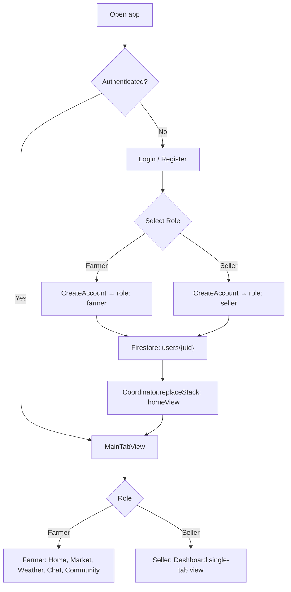
```mermaid
flowchart TD
    A[Open app] --> B{Authenticated?}
    B -->|No| C[Login / Register]
    B -->|Yes| D[MainTabView]

    C --> E{Select Role}
    E -->|Farmer| F["CreateAccount → role: farmer"]
    E -->|Seller| G["CreateAccount → role: seller"]

    F --> H["Firestore: users/{uid}"]
    G --> H

    H --> I["Coordinator.replaceStack: .homeView"]
    I --> D

    D --> J{Role}
    J -->|Farmer| K["Farmer: Home, Market, Weather, Chat, Community"]
    J -->|Seller| L["Seller: Dashboard single-tab view"]
```

### Role Routing

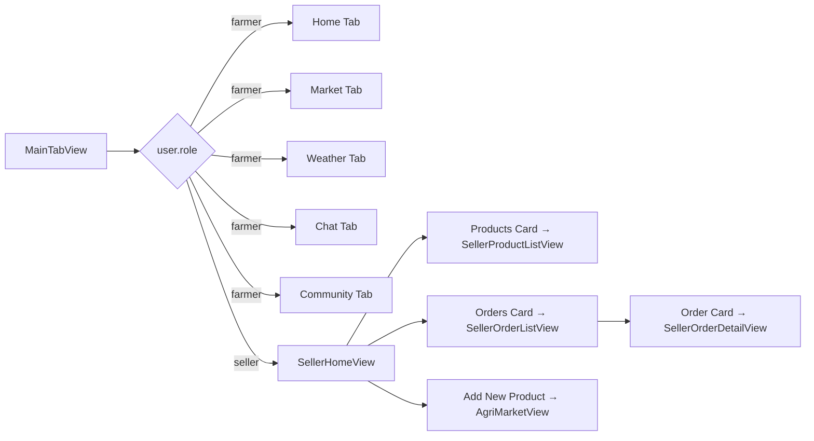
```mermaid
flowchart LR
    A[MainTabView] --> B{user.role}
    B -->|farmer| C[Home Tab]
    B -->|farmer| D[Market Tab]
    B -->|farmer| E[Weather Tab]
    B -->|farmer| F[Chat Tab]
    B -->|farmer| G[Community Tab]

    B -->|seller| H[SellerHomeView]
    H --> I["Products Card → SellerProductListView"]
    H --> J["Orders Card → SellerOrderListView"]
    J --> K["Order Card → SellerOrderDetailView"]
    H --> L["Add New Product → AgriMarketView"]
```

---

## E-Commerce Flow

### Browse → Cart → Order

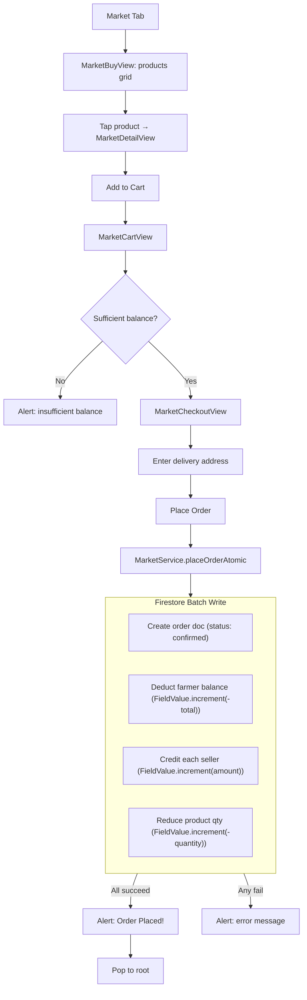
```mermaid
flowchart TD
    A[Market Tab] --> B[MarketBuyView: products grid]
    B --> C[Tap product → MarketDetailView]
    C --> D[Add to Cart]
    D --> E[MarketCartView]

    E --> F{Sufficient balance?}
    F -->|No| G[Alert: insufficient balance]
    F -->|Yes| H[MarketCheckoutView]

    H --> I[Enter delivery address]
    I --> J[Place Order]

    J --> K[MarketService.placeOrderAtomic]

    subgraph Batch [Firestore Batch Write]
        K1["Create order doc (status: confirmed)"]
        K2["Deduct farmer balance (FieldValue.increment(-total))"]
        K3["Credit each seller (FieldValue.increment(amount))"]
        K4["Reduce product qty (FieldValue.increment(-quantity))"]
    end

    K --> Batch
    Batch -->|All succeed| L[Alert: Order Placed!]
    Batch -->|Any fail| M[Alert: error message]
    L --> N[Pop to root]
```

### Seller Order Management

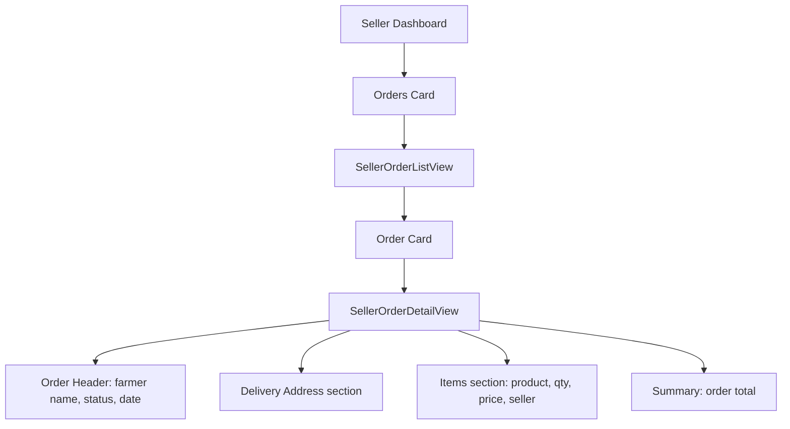
```mermaid
flowchart TD
    A[Seller Dashboard] --> B[Orders Card]
    B --> C[SellerOrderListView]

    C --> D[Order Card]
    D --> E[SellerOrderDetailView]

    E --> F[Order Header: farmer name, status, date]
    E --> G[Delivery Address section]
    E --> H[Items section: product, qty, price, seller]
    E --> I[Summary: order total]
```

### Seller Product Management

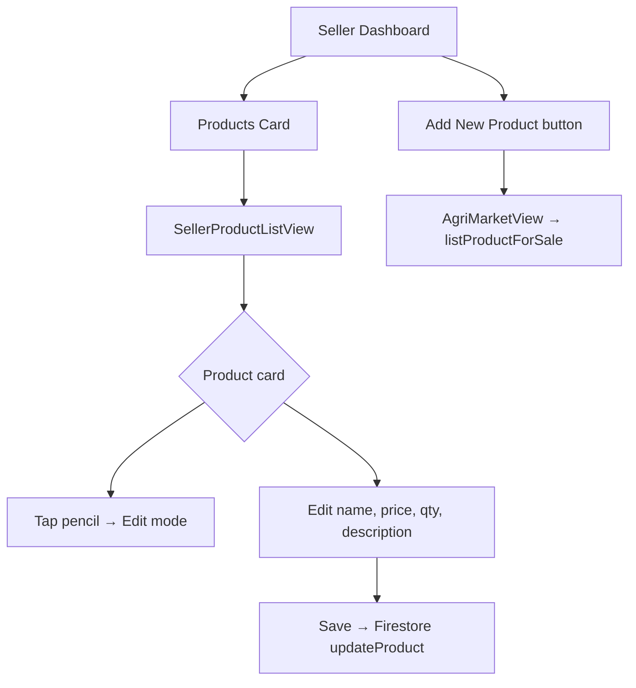
```mermaid
flowchart TD
    A[Seller Dashboard] --> B[Products Card]
    B --> C[SellerProductListView]

    C --> D{Product card}
    D --> E[Tap pencil → Edit mode]
    D --> F[Edit name, price, qty, description]
    F --> G[Save → Firestore updateProduct]

    A --> H[Add New Product button]
    H --> I[AgriMarketView → listProductForSale]
```

### Star Rating & Review

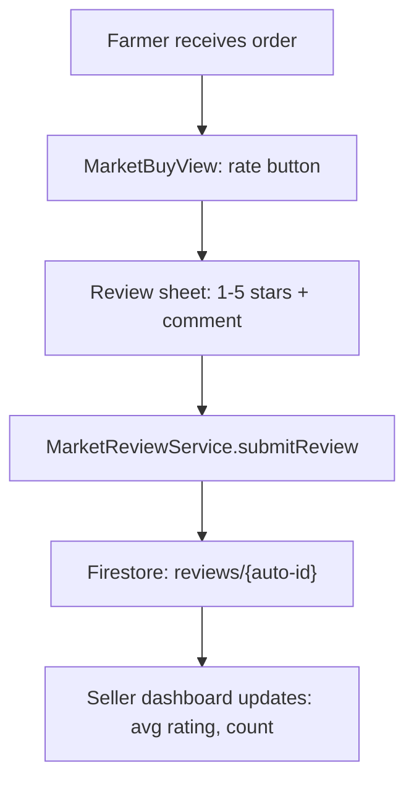
```mermaid
flowchart TD
    A[Farmer receives order] --> B[MarketBuyView: rate button]
    B --> C[Review sheet: 1-5 stars + comment]
    C --> D[MarketReviewService.submitReview]
    D --> E["Firestore: reviews/{auto-id}"]
    E --> F[Seller dashboard updates: avg rating, count]
```

---

## Data Model

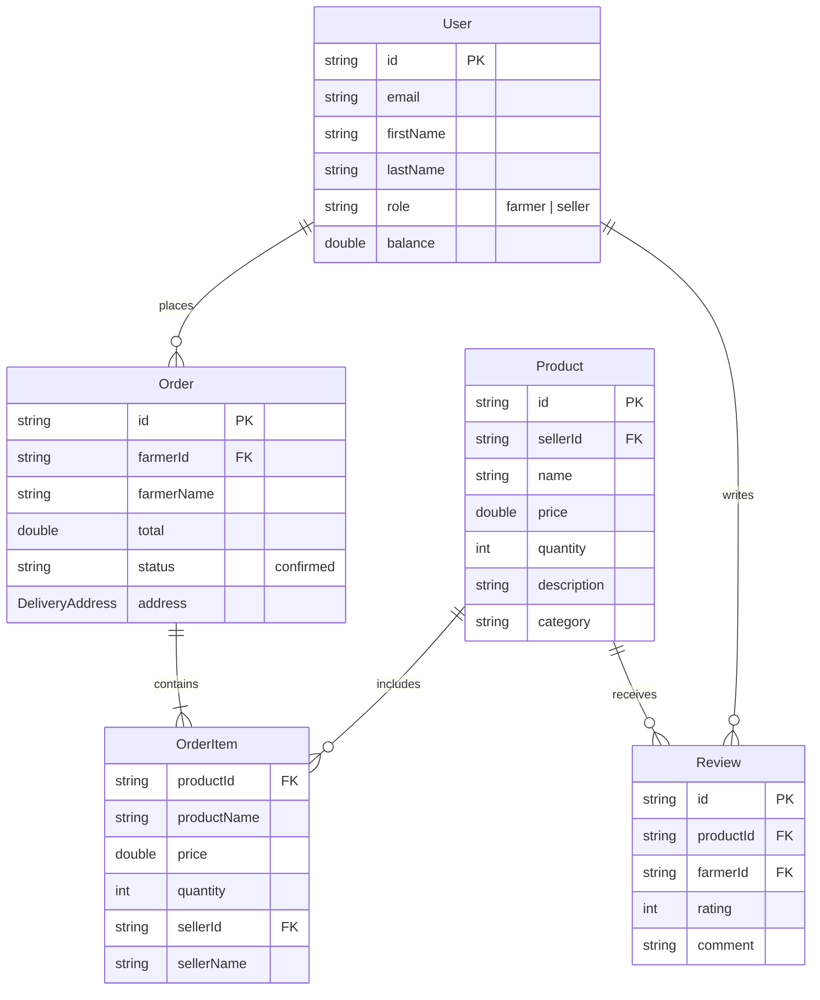
```mermaid
erDiagram
    User ||--o{ Order : places
    User ||--o{ Review : writes
    User {
        string id PK
        string email
        string firstName
        string lastName
        string role "farmer | seller"
        double balance
    }
    Product ||--o{ OrderItem : includes
    Product ||--o{ Review : receives
    Product {
        string id PK
        string sellerId FK
        string name
        double price
        int quantity
        string description
        string category
    }
    Order ||--|{ OrderItem : contains
    Order {
        string id PK
        string farmerId FK
        string farmerName
        double total
        string status "confirmed"
        DeliveryAddress address
    }
    OrderItem {
        string productId FK
        string productName
        double price
        int quantity
        string sellerId FK
        string sellerName
    }
    Review {
        string id PK
        string productId FK
        string farmerId FK
        int rating
        string comment
    }
```

---

## Firestore Security Rules

```
rules_version = '2';
service cloud.firestore {
  match /databases/{database}/documents {

    // Users: self-write for all fields; cross-user writes for balance only
    match /users/{userId} {
      allow read: if request.auth != null;
      allow create: if request.auth.uid == userId;
      allow update: if request.auth != null && (
        request.auth.uid == userId ||
        request.resource.data.diff(resource.data).affectedKeys().hasOnly(["balance"])
      );
      allow delete: if request.auth.uid == userId;
    }

    // Products: seller edits all; anyone reduces quantity
    match /products/{productId} {
      allow read: if request.auth != null;
      allow create: if request.auth != null
                    && request.resource.data.sellerId == request.auth.uid;
      allow update: if request.auth != null && (
        request.auth.uid == resource.data.sellerId ||
        request.resource.data.diff(resource.data).affectedKeys().hasOnly(["quantity"])
      );
      allow delete: if request.auth != null
                    && resource.data.sellerId == request.auth.uid;
    }

    // Orders
    match /orders/{orderId} {
      allow read: if request.auth != null;
      allow create: if request.auth != null
                    && request.resource.data.farmerId == request.auth.uid;
      allow update: if request.auth != null;
    }

    // Reviews
    match /reviews/{reviewId} {
      allow read: if request.auth != null;
      allow create: if request.auth != null
                    && request.resource.data.farmerId == request.auth.uid;
      allow delete: if request.auth != null
                    && resource.data.farmerId == request.auth.uid;
    }
  }
}
```

---

## Requirements

| Requirement | Minimum |
|-------------|---------|
| **iOS** | 16.6+ |
| **Device** | iPhone (all models with camera) |
| **Storage** | ~200 MB free |
| **Internet** | Required for weather, chat, community, AI reports, marketplace (classification runs 100% on-device) |
| **Permissions** | Camera, Photo Library, Location (optional for weather) |

---

## Setup & Installation

### Prerequisites

- Xcode 15+ (tested on Xcode 26.2)
- CocoaPods (`sudo gem install cocoapods`)
- Apple Developer account (free or paid)

### Steps

```bash
# 1. Clone the repository
git clone <repo-url>
cd DisasesClassificationApp

# 2. Install CocoaPods dependencies (TensorFlow Lite headers)
pod install

# 3. Create Config.xcconfig (copy template)
touch Config.xcconfig
```

**Config.xcconfig** (gitignored — you must create this):

```
GEMINI_API_KEY = your_gemini_api_key_here
DEEPSEEK_API_KEY = your_deepseek_api_key_here
```

Get API keys:
- **Gemini**: https://aistudio.google.com/app/apikey (free tier available)
- **DeepSeek**: https://platform.deepseek.com/api_keys (free trial available)

```bash
# 4. Open Xcode workspace
open DisasesClassificationApp.xcworkspace

# 5. Select your team in Signing & Capabilities
# 6. Build & Run (Cmd+R)
```

> The Cloudinary unsigned upload preset `AgriBDImageUpload` must exist in your [Cloudinary Console](https://console.cloudinary.com) → Settings → Upload → Add upload preset (Signing mode: **Unsigned**) for image uploads to work.

---

## Architecture

```
                    ┌──────────────────────────────────────┐
                    │         CoordinatorView              │
                    │    (NavigationStack + Auth Gate)     │
                    └──────────┬───────────────────────────┘
                               │
              ┌────────────────┼─────────────────────┐
              ▼                ▼                      ▼
     ┌──────────────┐  ┌──────────────┐  ┌─────────────────────┐
     │  LoginView    │  │ CreateAcc..  │  │   MainTabView      │
     │ (Unauthed)    │  │ View (Reg)   │  │  (Role-based tabs) │
     └──────────────┘  └──────────────┘  └───┬──┬──┬──┬──┬─────┘
                                              │  │  │  │  │
           ┌──────────────────────────────────┼──┼──┼──┼──┼──────────┐
           ▼          ▼          ▼          ▼  ▼  ▼  ▼  ▼          ▼
     ┌──────────┐ ┌──────────┐ ┌──────────┐ ┌───────────────────────────┐
     │  Home    │ │ Market   │ │ Weather  │ │  Chat   │ Community       │
     │  Tab     │ │ Tab      │ │ Tab      │ │  Tab    │ Tab             │
     └──────────┘ └──────────┘ └──────────┘ └─────────┴────────────────┘

     ┌─────────────────────────────────────────────────────┐
     │  Seller single-tab: SellerHomeView                  │
     │  → Products Card → ProductList → inline edit       │
     │  → Orders Card   → OrderList   → OrderDetail       │
     │  → Add New Product → AgriMarketView                 │
     └─────────────────────────────────────────────────────┘
```

### Design Patterns

| Pattern | Usage |
|---------|-------|
| **MVVM** | Every feature: View (SwiftUI) ↔ ViewModel (`@Published`) ↔ Model/Service |
| **Singleton** | `MarketService`, `AuthManager`, `FirestoreManager`, `TFLiteService`, `GeminiService`, `DeepSeekService`, `CloudinaryService` |
| **Coordinator** | `Coordinator` (`NavigationPath`) + `Page` enum — manages auth-based routing and push navigation |
| **Dependency Injection** | ViewModels receive services via initializer params; `Coordinator` and `AuthManager` injected as `@EnvironmentObject` |
| **Strategy / Fallback** | GeminiService tries 3 models (flash-lite → flash → flash-preview); DiseaseReportService cascades Gemini → DeepSeek |
| **Batch Write (ACID)** | `Firestore.batch()` for atomic order placement: order doc + balance deduction + seller credit + stock reduction |

---

## Project Structure

```
DisasesClassificationApp/
├── Config.xcconfig                       # API keys (gitignored)
├── Podfile                               # TFLite dependency
│
├── DiseasesClassificationAppApp.swift    # @main entry: Firebase init + CoordinatorView
│
├── Coordinator/                          # Navigation
│   ├── Coordinator.swift                 # NavigationPath + push/pop/replace
│   ├── CoordinatorView.swift             # Root NavigationStack + auth gate
│   └── Page.swift                        # Navigable page enum
│
├── Authentication/                       # Auth Module
│   ├── Manager/                          # AuthManager, FirebaseAuthManager,
│   │                                     # GoogleSignInManager, FirestoreManager
│   ├── Model/UserModel.swift
│   └── ViewModel + View/                 # Login, CreateAccount
│
├── Seller/                               # Seller Module
│   ├── ViewModel/SellerViewModel.swift   # Dashboard data, product editing
│   └── View/SellerHomeView.swift         # Dashboard, ProductList, OrderList, OrderDetail
│
├── AgriMarket/                           # E-Commerce Module
│   ├── Service/MarketService.swift       # CRUD, placeOrderAtomic (batch write)
│   ├── Service/MarketReviewService.swift # Review submission & fetching
│   ├── Model/MarketProduct.swift         # Product, CartItem, Order, Review models
│   ├── ViewModel/MarketViewModel.swift   # Cart, checkout, order placement
│   └── View/                             # MarketBuyView, MarketCartView,
│                                         # MarketCheckoutView, AgriMarketView
│
├── Home/                                 # Dashboard Module
│   ├── Manager/                          # LocationManager, WeatherNetworkManager
│   ├── Model/                            # FeatureModel, WeatherModel
│   ├── ViewModel/                        # HomeViewModel, DrawerViewModel
│   └── View/                             # MainTabView, HomeView, DrawerView,
│                                         # FeatureCardView, WeatherCardView
│
├── Weather/                              # Weather Tab Module
│   ├── Manager/SprayingCalculator.swift
│   ├── Model/SprayingModels.swift
│   └── ViewModel + View/
│
├── Chat/                                 # Chat Module
│   ├── Manager/                          # GeminiService, DeepSeekService
│   └── Model + ViewModel + View/
│
├── Community/                            # Community Module
│   ├── Manager/                          # CommunityService, CloudinaryService
│   └── Model + ViewModel + View/
│
├── DiseaseClassification/               # Disease Scanner Module
│   ├── Service/                          # TFLiteService, DiseaseReportService
│   ├── Utility/PDFGenerator.swift
│   └── Model + ViewModel + View/
│
├── Resources/
│   ├── lables.txt                        # 29 disease class names
│   ├── plantDiseaseModel.tflite          # TFLite model (224×224, 29 classes)
│   └── Assets.xcassets/
│
└── Frameworks/
    └── TensorFlowLiteC.xcframework       # TFLite C runtime (arm64 + simulator)
```

---

## Key Flows

### 🔐 Authentication

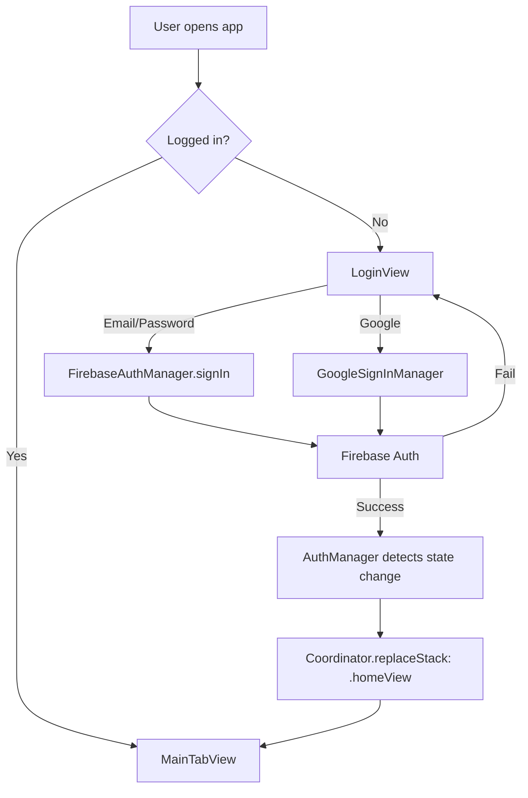
```mermaid
flowchart TD
    A[User opens app] --> B{Logged in?}
    B -->|No| C[LoginView]
    B -->|Yes| D[MainTabView]

    C -->|Email/Password| E[FirebaseAuthManager.signIn]
    C -->|Google| F[GoogleSignInManager]

    E --> G[Firebase Auth]
    F --> G

    G -->|Success| H[AuthManager detects state change]
    G -->|Fail| C

    H --> I[Coordinator.replaceStack: .homeView]
    I --> D
```

### 🔬 Disease Classification & Report

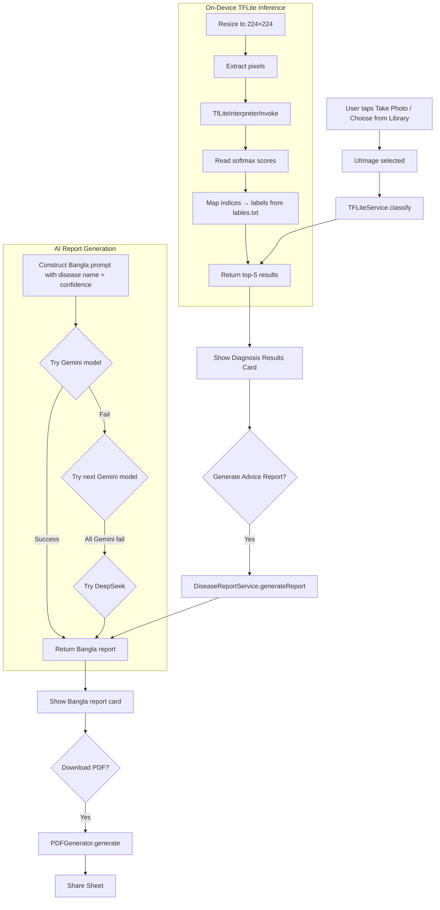
```mermaid
flowchart TD
    A[User taps Take Photo / Choose from Library] --> B[UIImage selected]
    B --> C[TFLiteService.classify]

    subgraph TFLite [On-Device TFLite Inference]
        C1[Resize to 224×224] --> C2[Extract pixels]
        C2 --> C3[TfLiteInterpreterInvoke]
        C3 --> C4[Read softmax scores]
        C4 --> C5[Map indices → labels from lables.txt]
        C5 --> C6[Return top-5 results]
    end

    C --> C6
    C6 --> D[Show Diagnosis Results Card]

    D --> E{Generate Advice Report?}
    E -->|Yes| F[DiseaseReportService.generateReport]

    subgraph AI [AI Report Generation]
        F1[Construct Bangla prompt with disease name + confidence]
        F1 --> F2{Try Gemini model}
        F2 -->|Success| F5[Return Bangla report]
        F2 -->|Fail| F3{Try next Gemini model}
        F3 -->|All Gemini fail| F4{Try DeepSeek}
        F4 --> F5
    end

    F --> F5
    F5 --> G[Show Bangla report card]

    G --> H{Download PDF?}
    H -->|Yes| I[PDFGenerator.generate]
    I --> J[Share Sheet]
```

### 💬 Chat (Gemini → DeepSeek Fallback)

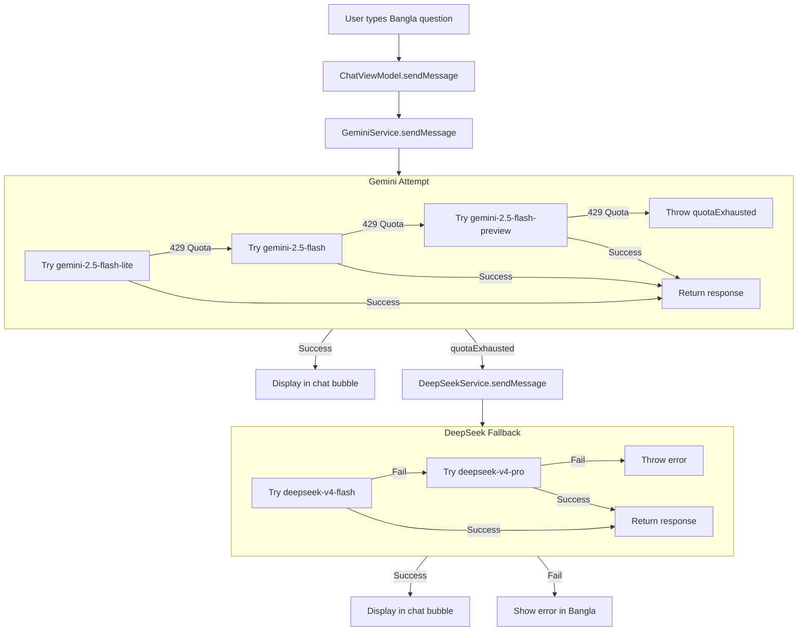
```mermaid
flowchart TD
    A[User types Bangla question] --> B[ChatViewModel.sendMessage]
    B --> C[GeminiService.sendMessage]

    subgraph Gemini [Gemini Attempt]
        D1[Try gemini-2.5-flash-lite]
        D1 -->|429 Quota| D2[Try gemini-2.5-flash]
        D2 -->|429 Quota| D3[Try gemini-2.5-flash-preview]
        D3 -->|429 Quota| E[Throw quotaExhausted]
        D1 -->|Success| F[Return response]
        D2 -->|Success| F
        D3 -->|Success| F
    end

    C --> Gemini
    Gemini -->|Success| G[Display in chat bubble]
    Gemini -->|quotaExhausted| H[DeepSeekService.sendMessage]

    subgraph DeepSeek [DeepSeek Fallback]
        I1[Try deepseek-v4-flash]
        I1 -->|Fail| I2[Try deepseek-v4-pro]
        I2 -->|Fail| J[Throw error]
        I1 -->|Success| K[Return response]
        I2 -->|Success| K
    end

    H --> DeepSeek
    DeepSeek -->|Success| L[Display in chat bubble]
    DeepSeek -->|Fail| M[Show error in Bangla]
```

### 🌦️ Weather & Spraying

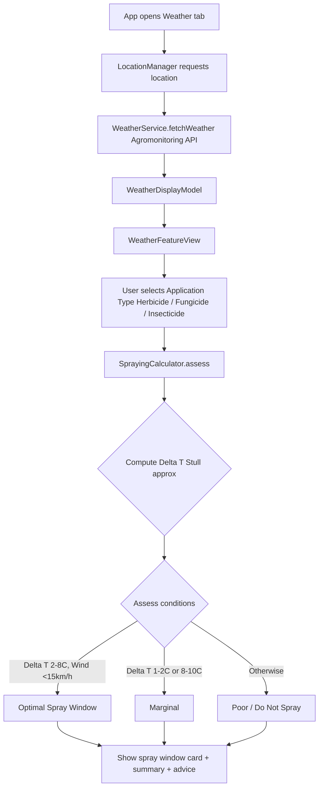
```mermaid
flowchart TD
    A[App opens Weather tab] --> B[LocationManager requests location]
    B --> C[WeatherService.fetchWeather Agromonitoring API]
    C --> D[WeatherDisplayModel]
    D --> E[WeatherFeatureView]

    E --> F[User selects Application Type Herbicide / Fungicide / Insecticide]
    F --> G[SprayingCalculator.assess]

    G --> H{Compute Delta T Stull approx}
    H --> I{Assess conditions}
    I -->|Delta T 2-8C, Wind <15km/h| J[Optimal Spray Window]
    I -->|Delta T 1-2C or 8-10C| K[Marginal]
    I -->|Otherwise| L[Poor / Do Not Spray]

    J & K & L --> M[Show spray window card + summary + advice]
```

### 👥 Community

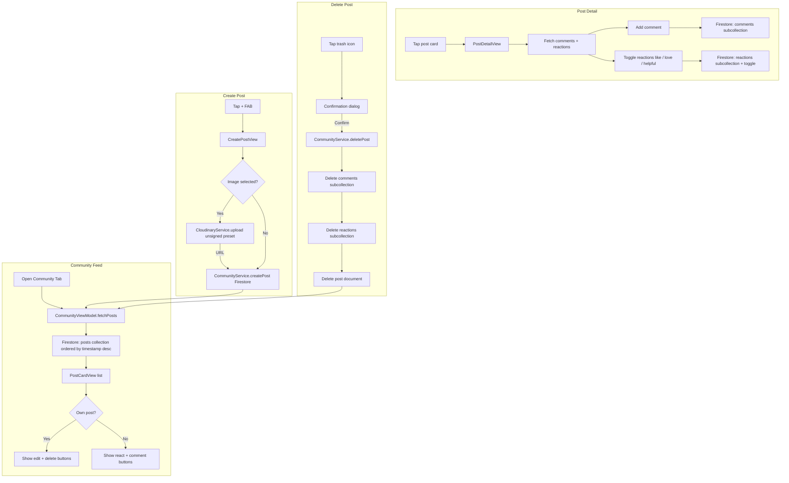
```mermaid
flowchart TD
    subgraph Feed [Community Feed]
        A[Open Community Tab] --> B[CommunityViewModel.fetchPosts]
        B --> C[Firestore: posts collection ordered by timestamp desc]
        C --> D[PostCardView list]
        D --> E{Own post?}
        E -->|Yes| F[Show edit + delete buttons]
        E -->|No| G[Show react + comment buttons]
    end

    subgraph Create [Create Post]
        H[Tap + FAB] --> I[CreatePostView]
        I --> J{Image selected?}
        J -->|Yes| K[CloudinaryService.upload unsigned preset]
        K -->|URL| L[CommunityService.createPost Firestore]
        J -->|No| L
        L --> B
    end

    subgraph Detail [Post Detail]
        M[Tap post card] --> N[PostDetailView]
        N --> O[Fetch comments + reactions]
        O --> P[Toggle reactions like / love / helpful]
        O --> Q[Add comment]
        Q --> R[Firestore: comments subcollection]
        P --> S[Firestore: reactions subcollection + toggle]
    end

    subgraph Delete [Delete Post]
        T[Tap trash icon] --> U[Confirmation dialog]
        U -->|Confirm| V[CommunityService.deletePost]
        V --> W[Delete comments subcollection]
        W --> X[Delete reactions subcollection]
        X --> Y[Delete post document]
        Y --> B
    end
```

---

## Tech Stack

| Layer | Technology | Purpose |
|-------|-----------|---------|
| **Language** | Swift 5.9 | iOS app development |
| **UI** | SwiftUI | Declarative UI across all screens |
| **Architecture** | MVVM + Coordinator + Singleton services | Clean separation of concerns |
| **Database** | Firebase Firestore | Products, orders, reviews, users, community posts |
| **Authentication** | Firebase Auth + Google Sign-In | Email/password + Google OAuth with role selection |
| **On-Device ML** | TensorFlow Lite C API | 29-class plant disease classification |
| **AI Reports & Chat** | Gemini 2.5 Flash + DeepSeek (fallback) | Bangla AI assistant |
| **Image Hosting** | Cloudinary (unsigned upload) | Profile photos, community post images |
| **Weather** | Agromonitoring API | Real-time weather + historical data |
| **PDF** | Core Text (`CTFramesetter`) | Multi-page PDF report generation |
| **Image Picker** | `PhotosPicker` + `UIImagePickerController` | Camera & photo library access |
| **Dependency Mgmt** | SPM + CocoaPods | Firebase, Cloudinary, GoogleSignIn, TFLite |

---

## Configuration Reference

| Key | Where | Source |
|-----|-------|--------|
| `GEMINI_API_KEY` | `Config.xcconfig` → `Info.plist` | Google AI Studio |
| `DEEPSEEK_API_KEY` | `Config.xcconfig` → `Info.plist` | DeepSeek Platform |
| Weather API key | Hardcoded in `WeatherNetworkManager.swift` | Agromonitoring |
| Cloudinary cloud/preset | Hardcoded in `CloudinaryService.swift` | Cloudinary Console |
| Firebase config | `GoogleService-Info.plist` (in repo) | Firebase Console |

---

## Target Users

- **Bangladeshi farmers** — browse and buy agricultural products (seeds, medicines, fertilizers, equipment), diagnose diseases with AI, check spray weather
- **Sellers** — list products, manage inventory, track orders and earnings via the seller dashboard
- **Agricultural extension officers** — diagnose diseases and advise farmers
- **Students & researchers** — studying plant pathology, machine learning in agriculture, or marketplace app architecture
